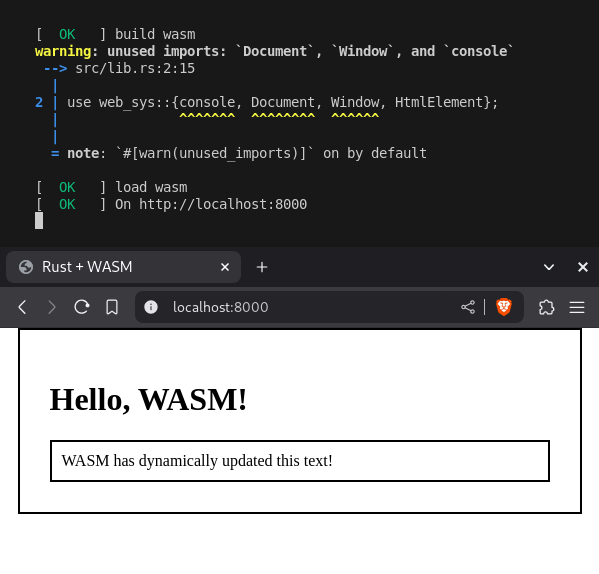

<p align="center">
  
</p>

# WASM-Developer-Template


Love the philosophy of JAMstack? Hate javascript but love Rust?
This sets up a Rust WASM project for you, where all the javascript is either pre-written or is compiled via running `./deploy.sh`.

This repo utilizes github pages to host the example webpage from this project [here](https://willemdoesit.github.io/WASM-Developer-Template/web/index).

I believe any open source project should be easy to use on any OS, I have put in nix flakes so MacOS/Linux devs can share the developer environment I had as I made/make this.

# Installation

## Developer Install for Windows
[Install Rust](https://www.rust-lang.org/tools/install), [Git bash](https://git-scm.com/downloads/win), and [install Python313](https://www.python.org/downloads/).
Then execute the following in gitbash:

```bash
# DOWNLOAD REPO
git clone https://gitlab.com/willemdoesgit1/rust-wasm.git
cd WASM-Developer-Template

# IMPERATIVE ONE-TIME COMMANDS
cargo install wasm-bindgen-cli                  # wasm-bindgen-cli
rustup target add wasm32-unknown-unknown        # setup for compilation

# COMPILE AND LOCALHOST
./deploy.sh
```


## Developer Install for MacOS and Linux
### Using Nix
Assuming you are on nixos, have nix packages, or are willing to install nix packages; then this is easy. <br>
Install nix with if you haven't already `sh <(curl -L https://nixos.org/nix/install) --daemon`

Then execute the following in the terminal:
```bash
# DOWNLOAD REPO
nix-shell -p git --run "git clone https://gitlab.com/willemdoesgit1/rust-wasm.git" 
cd WASM-Developer-Template

# ENTER DEVELOPER ENVIRONMENT
nix developer

# COMPILE AND LOCALHOST
./deploy.sh
```

> [!NOTE]
> If you wish to enter the developer environment in a specific shell, like fish, you would do `nix develop -c fish`, this works for bash and zsh too.
>
> Use `exit` to escape the shell.

### Without Nix 
If you don't want to use nix, run the following in the terminal:

```bash
# DOWNLOAD REPO
git clone https://gitlab.com/willemdoesgit1/rust-wasm.git
cd WASM-Developer-Template

# IMPERATIVE ONE-TIME COMMANDS
curl --proto '=https' --tlsv1.2 https://sh.rustup.rs -sSf | sh
!!! MISSING STUFF !!! READ NOTE !!!

# COMPILE AND LOCALHOST
./deploy.sh
```

> [!NOTE]
> This part of the readme isn't finished, dependencies are missing, I assuming installing is the same process on windows (as it's bash in both instances), but this is not yet confirmed.
>
> This assumes git is installed, if not [here is a guide](https://git-scm.com/downloads/linux)
